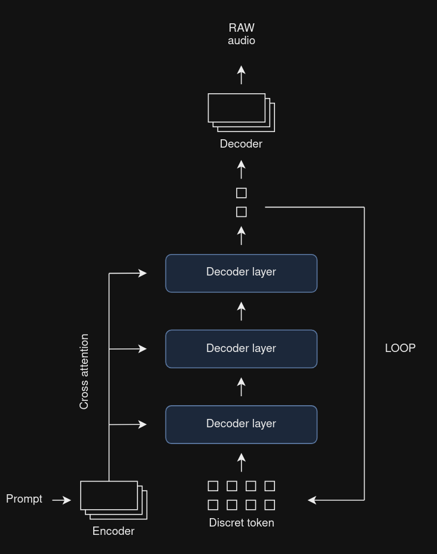

# WaveAI
A model that can make edit of music based on a prompt. Follow MusicGen architecture.



# Installation

```py
python -m pip install -r requirements.txt
```

# Write a config file

```yaml
model:
  num_codebooks: 9
  codebook_size: 1024
  hidden_size: 1024
  cross_att_hidden_size: 512
  max_seq_length: 3100
  decoder_depth: 12
  decoder_heads: 16
  cross_att: false

  pad_token_id: 1024

codec:
  name: 'DAC'

data:
  audio_dir: '/media/works/audio/'
  save_dir: './.data2'
  duration: 30
  prompt: false
  overwrite: false

train:
  max_epochs: 10
  accumulate_grad_batches: 50
  gradient_clip_val: 1 

inference:
  checkpoint_path: 'WAVEAI/xw0t0lls/checkpoints/epoch=8-step=6678.ckpt'

Encodec:
  bandwidth: 3.0

DAC:
  num_quantizers: 9
```

# Launch the trainig

```py
python3 train.py
```

# License

See the LICENSE file.